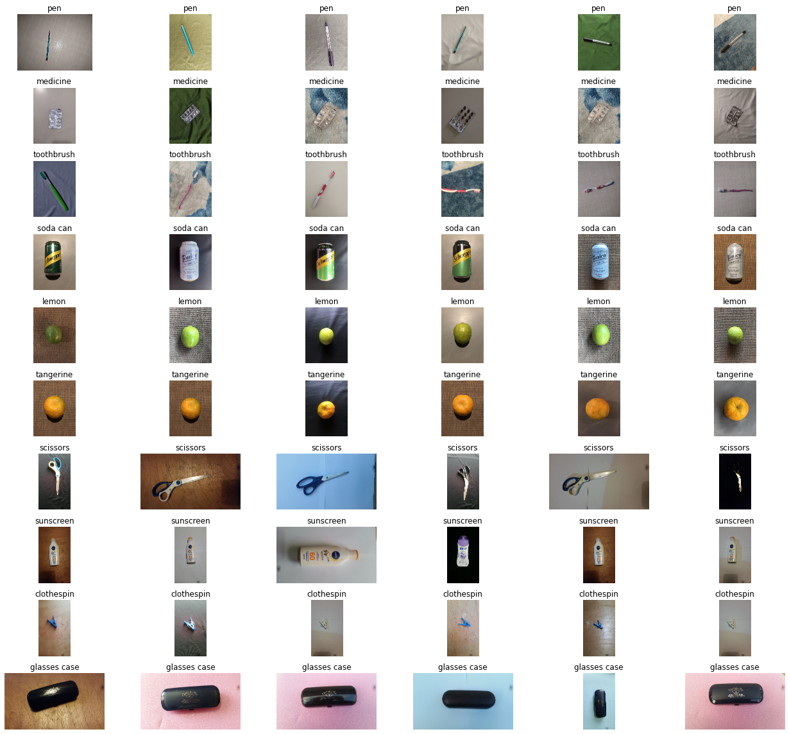

# This is the dataset used in Computer Vision class [MAC5768/USP]

All the code produced will be focused in this repo. The projects (EP 1,2 and 3) are divided in branchs.

>The full database with the images can be found [here](https://drive.google.com/drive/folders/1GJD9P-zUVVOHRNSenVLbm_XS1joCXYm-?usp=sharing)

NOTE: Dataset not complet yet

## GLOBAL SUMMARY

GLOBAL TABLE

Number of classes: 10

Number of images: 1115

Database size: 2558.919 MB

Image resolution and ammount of each resolution:

|rows | cols  | repetitions|
|:---:|:-----:|:----------:|
|1536 | 2048  |   9        |
|2048 | 1536  | 315        |
|2988 | 5312  | 149        |
|3000 | 4000  |  28        |
|4000 | 3000  | 332        |
|5312 | 2988  | 282        |

## SUMMARY BY CLASS

|object_name|number_of_objects|background|lighting|number_of_repetions|number_of_samples|
|-----------|-----------------|----------|--------|-------------------|-----------------|
|pen|4|beige pottery;white table;shades blue fabric;beige grained pottery;green fabric;white fabric|4 lighting variations: indoor-day, indoor-night, outdoor-day, outdoor-night|3|144|
|medicine|3|beige pottery;white table;shades blue fabric;beige grained pottery;green fabric;white fabric|4 lighting variations: indoor-day, indoor-night, outdoor-day, outdoor-night|3|108|
|toothbrush|3|beige pottery;white table;shades blue fabric;beige grained pottery;green fabric;white fabric|4 lighting variations: indoor-day, indoor-night, outdoor-day, outdoor-night|3|108|
|soda can| 3| black vinyl cushion;jute carpet; cement floor;black vinyl cushion;cement floor| 4 lighting variations: indoor-day, indoor-night, outdoor-day, outdoor-night| 3| 108|
|lemon| 3| jute carpet; cement floor; black vinyl cushion;cement floor;black vinyl cushion| 4 lighting variations: indoor-day, indoor-night, outdoor-day, outdoor-night| 3| 108|
|tangerine| 3| jute carpet; cement floor; black vinyl cushion;black vinyl cushion;cement floor| 4 lighting variations: indoor-day, indoor-night, outdoor-day, outdoor-night| 3| 108|
|scissors| 3| pink styrofoam;blue sheet of paper;wooden board| 4 lighting variations: indoor-day, indoor-night, outdoor-day, outdoor-night| 3| 108|
|sunscreen| 3| black polyester fabric;sheet of paper;wooden board| 4 lighting variations: indoor-day, indoor-night, outdoor-day, outdoor-night| 3,2| 107|
|clothespin| 3| sheet of paper;wooden board;black polyester fabric| 4 lighting variations: indoor-day, indoor-night, outdoor-day, outdoor-night| 3| 108|
|glasses case| 3| wooden board;pink styrofoam;blue sheet of paper| 4 lighting variations: indoor-day, indoor-night, outdoor-day, outdoor-night| 3| 108|

## Sample of the dataset

