# [EP2] MAC0417/5768 - Visão e Processamento de Imagens (2021)

### Authors:
 - Suayder Milhomem
 - David Oliveira
 - Daniel Hotta

## Simple description

This notebook uses the the classes that we have created in order to describe and read our dataset of objects.

- The libs can be found in this [repository](https://github.com/suayder/computer_vision_eps_usp.git) in a branch named EP2

- The full dataset of images can be found [here](https://drive.google.com/drive/folders/1GJD9P-zUVVOHRNSenVLbm_XS1joCXYm-?usp=sharing).

- The augmented dataset can be found [here](https://drive.google.com/drive/folders/12VkujKaxqRLSw0WmiearpAcSVmWcGUaL?usp=sharing)

- The normalized dataset can be found [here](https://drive.google.com/drive/folders/1GiaHAkYCSkgVvktgkbBAYJIR9ETHqxpw?usp=sharing)

Based on the goals of the EP2 we listed each result in separate sections as follows:

## Image augmentation:

The dataset was augmented using the following operations:

- [RGB2gray](https://github.com/suayder/computer_vision_eps_usp/blob/6bb0e46e5ddc7db17ac501f61fcb1701e96ad4a4/src/transform/img_transformers.py#L15)
- [GradientSum](https://github.com/suayder/computer_vision_eps_usp/blob/6bb0e46e5ddc7db17ac501f61fcb1701e96ad4a4/src/transform/img_transformers.py#L24)
- [LogTransform](https://github.com/suayder/computer_vision_eps_usp/blob/6bb0e46e5ddc7db17ac501f61fcb1701e96ad4a4/src/transform/img_transformers.py#L66)
- [ExpTransform](https://github.com/suayder/computer_vision_eps_usp/blob/6bb0e46e5ddc7db17ac501f61fcb1701e96ad4a4/src/transform/img_transformers.py#L87)
- [MeanFilter](https://github.com/suayder/computer_vision_eps_usp/blob/6bb0e46e5ddc7db17ac501f61fcb1701e96ad4a4/src/transform/img_transformers.py#L109)

A brief explanation of the the code flow we adopted:

1. The class [Transform](https://github.com/suayder/computer_vision_eps_usp/blob/6bb0e46e5ddc7db17ac501f61fcb1701e96ad4a4/src/augmenter.py#L10) is instatiated passing the desired transformation functions.

2. Then the class [Augmenter](https://github.com/suayder/computer_vision_eps_usp/blob/6bb0e46e5ddc7db17ac501f61fcb1701e96ad4a4/src/augmenter.py#L45) is instantiated passing the object of Transform, and then we can called the methods, to transform. *In our specific case we called [process_by_class](https://github.com/suayder/computer_vision_eps_usp/blob/6bb0e46e5ddc7db17ac501f61fcb1701e96ad4a4/src/augmenter.py#L146)*

## Augmented Samples

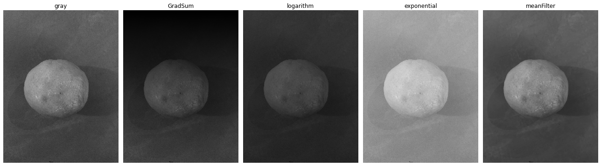

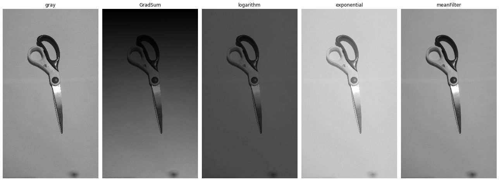

# Normalization

In order to normalize the dataset we run the same flow of the code used to get the augmented images but, for this case, we first resized the images in order to keep it all with the same size and then, we normalized the histograms via equalization.

We achieved this by calling [ImageEqualization](https://github.com/suayder/computer_vision_eps_usp/blob/361f487da8dce0d0447aded7adb57baeafbf84d4/src/transform/img_transformers.py#L157) and [Resize](https://github.com/suayder/computer_vision_eps_usp/blob/361f487da8dce0d0447aded7adb57baeafbf84d4/src/transform/img_transformers.py#L170).

## Normalized Samples

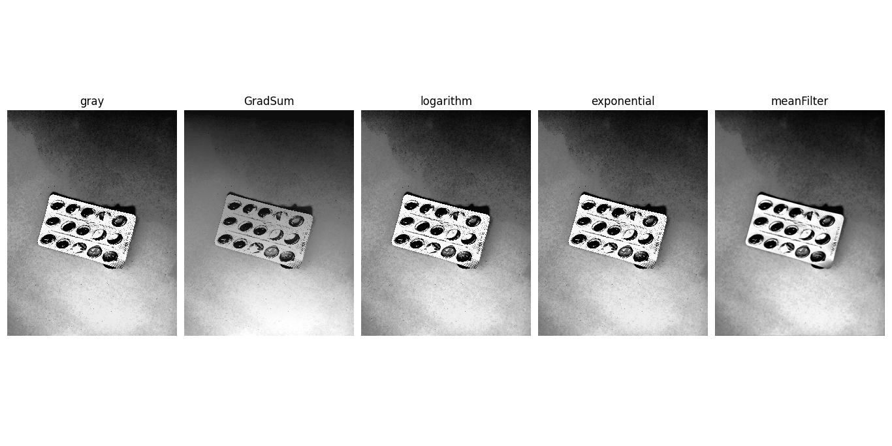

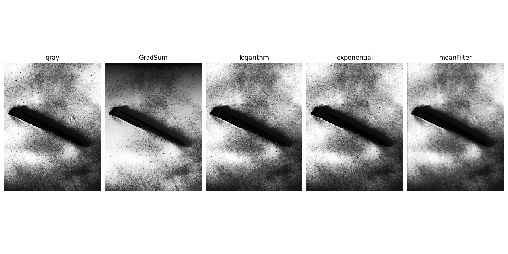

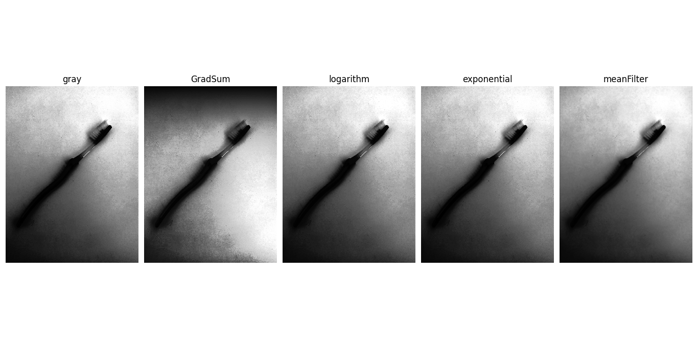

# Image prototypes and histogram mean/variance

From the dataset we got the histogram of the images using our class [ProcessNormalized](https://github.com/suayder/computer_vision_eps_usp/blob/d902bf9fddb770d24f6c38995e9cebda4b7f0666/src/normalize.py#L60) which processed the normalized (or not normalized) images and plot the mean of the values and the variances. To do this we used numpy and skimage libraries to process each value.

In the code, basicaly we go through each class of image in the method [process_by_class](https://github.com/suayder/computer_vision_eps_usp/blob/d902bf9fddb770d24f6c38995e9cebda4b7f0666/src/normalize.py#L87) and called the methods [build_mean_prototype](https://github.com/suayder/computer_vision_eps_usp/blob/d902bf9fddb770d24f6c38995e9cebda4b7f0666/src/normalize.py#L73) and [histogram_stats_by_class](https://github.com/suayder/computer_vision_eps_usp/blob/d902bf9fddb770d24f6c38995e9cebda4b7f0666/src/normalize.py#L151) that do the computation respectively of the mean prototype of the image (which is the mean of all images of each class) and mean and variance of the histogram in the class.

## Results gathered from the process

**Images from original gray dataset**

Mean prototype
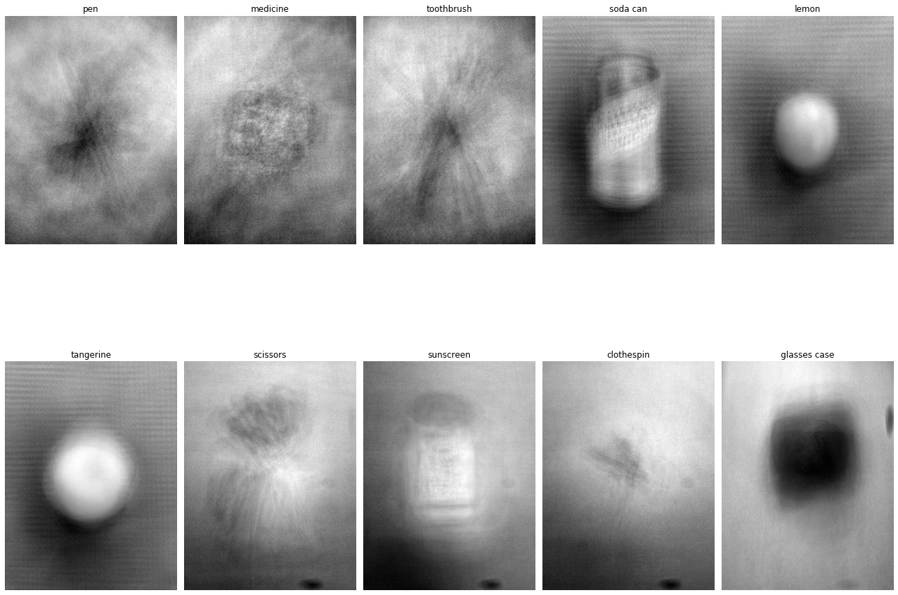

Mean histogram for the original-gray dataset
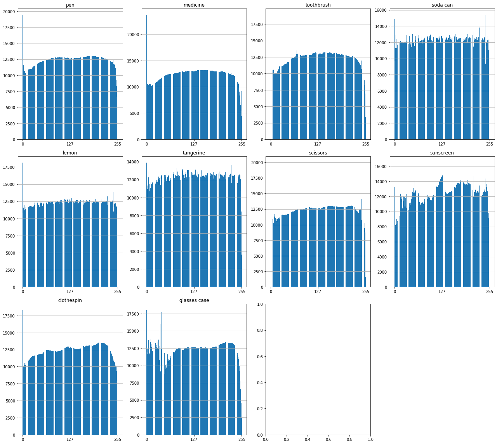

variance of the histogram for the original-gray dataset
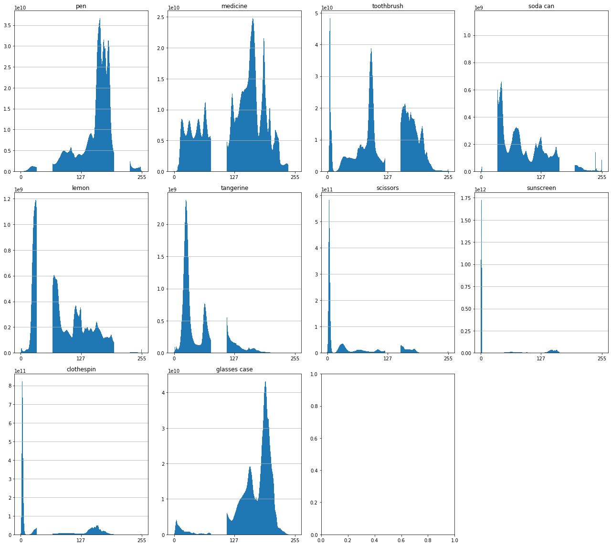

Mean histogram for the original-gray dataset **normalized**

variance of the histogram for the original-gray dataset **normalized**
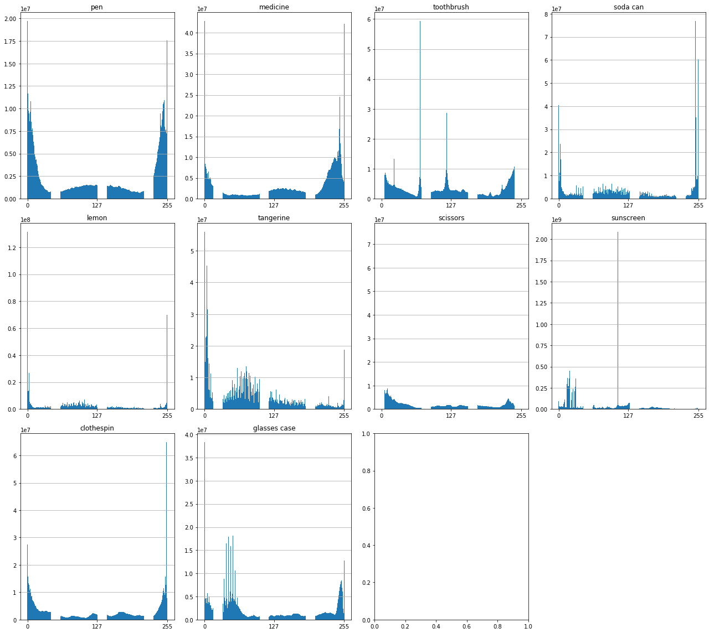

**Images for augmented dataset**

Mean prototype
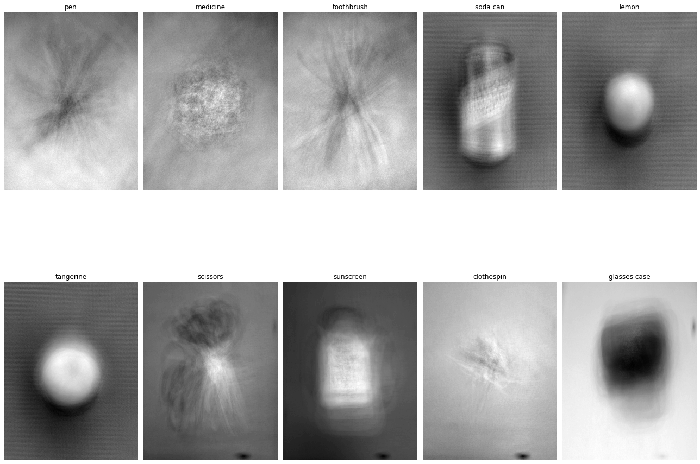

Mean histotogram for the full dataset
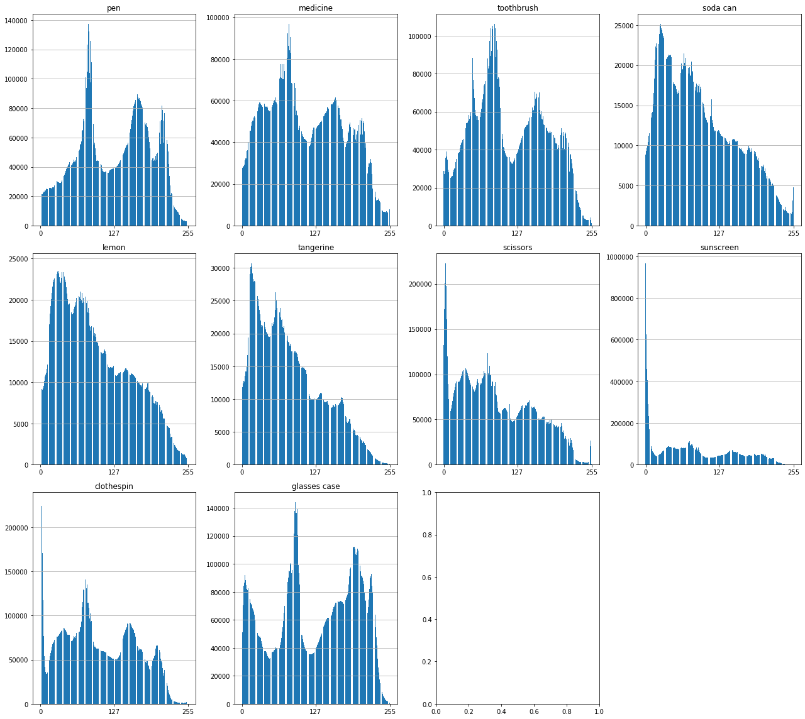

variance histotogram for the full dataset
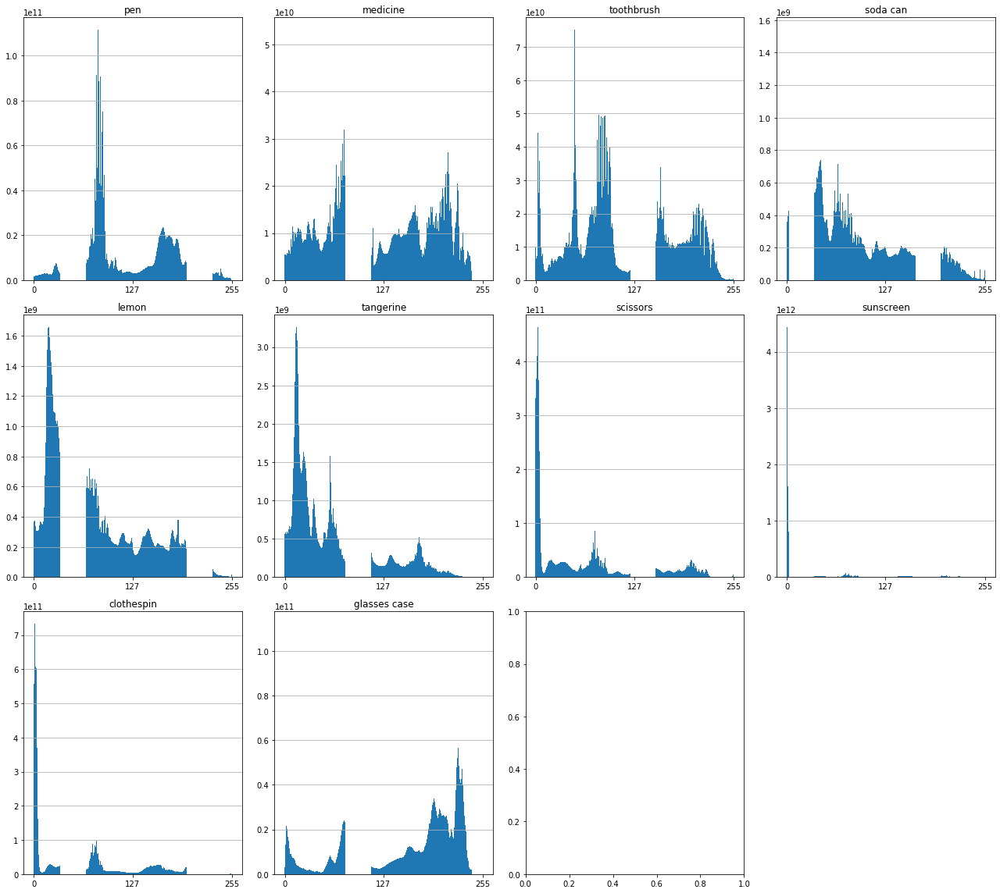

**Images for normalized dataset (with augmentations)**

Mean prototype
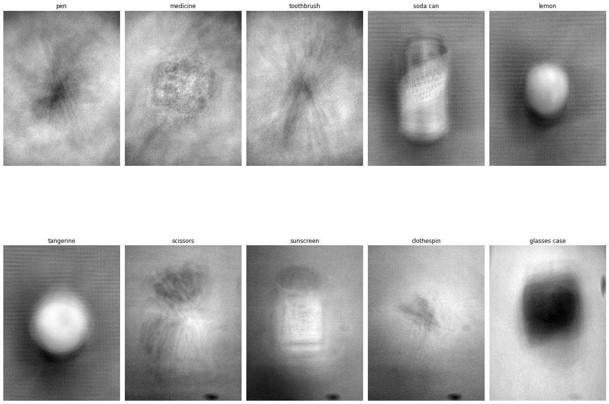

Mean histogram for the full dataset

variance histogram for the full dataset
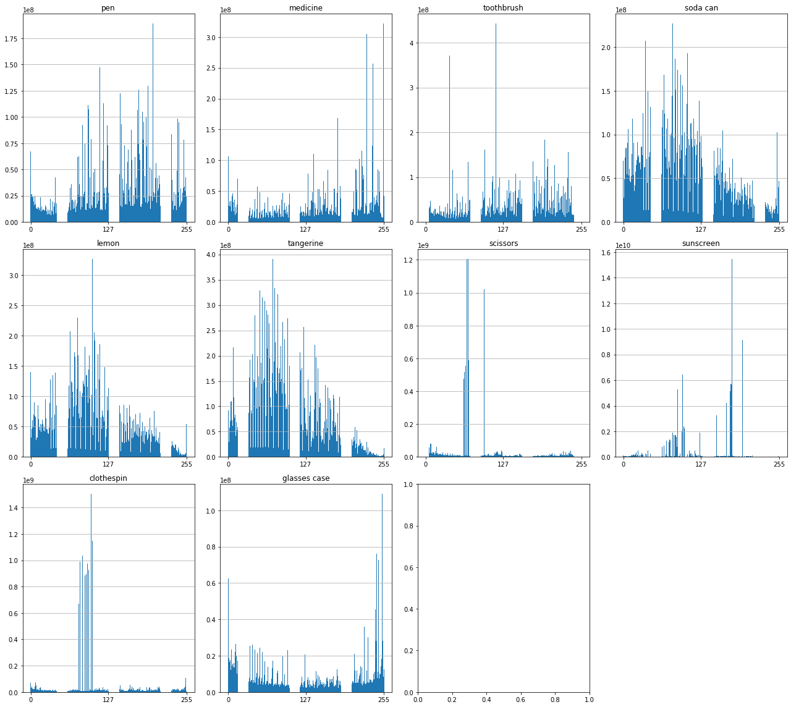
