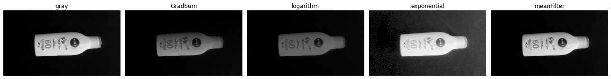
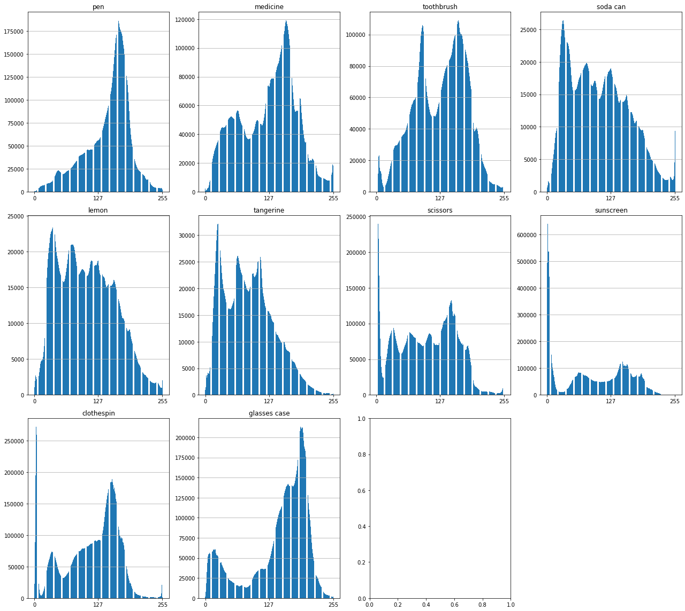

# [EP2] MAC0417/5768 - Visão e Processamento de Imagens (2021)

### Authors:
 - Suayder Milhomem
 - David Oliveira
 - Daniel Hotta

## Simple description

This notebook uses the the classes that we have created in order to describe and read our dataset of objects.

- The libs you can find in this [repository](https://github.com/suayder/computer_vision_eps_usp.git) in a branch named EP2

- The full dataset can be found [here](https://drive.google.com/drive/folders/1GJD9P-zUVVOHRNSenVLbm_XS1joCXYm-?usp=sharing).

- The augmented dataset can be found [here](https://drive.google.com/drive/folders/12VkujKaxqRLSw0WmiearpAcSVmWcGUaL?usp=sharing)

- The normalized dataset can be found [here](https://drive.google.com/drive/folders/1GiaHAkYCSkgVvktgkbBAYJIR9ETHqxpw?usp=sharing)

based on the goals of the EP2 we show each result in the the next sections.

## Image augmentation:

The dataset was augmented using the operations:

- [RGB2gray](https://github.com/suayder/computer_vision_eps_usp/blob/6bb0e46e5ddc7db17ac501f61fcb1701e96ad4a4/src/transform/img_transformers.py#L15)
- [GradientSum](https://github.com/suayder/computer_vision_eps_usp/blob/6bb0e46e5ddc7db17ac501f61fcb1701e96ad4a4/src/transform/img_transformers.py#L24)
- [LogTransform](https://github.com/suayder/computer_vision_eps_usp/blob/6bb0e46e5ddc7db17ac501f61fcb1701e96ad4a4/src/transform/img_transformers.py#L66)
- [ExpTransform](https://github.com/suayder/computer_vision_eps_usp/blob/6bb0e46e5ddc7db17ac501f61fcb1701e96ad4a4/src/transform/img_transformers.py#L87)
- [MeanFilter](https://github.com/suayder/computer_vision_eps_usp/blob/6bb0e46e5ddc7db17ac501f61fcb1701e96ad4a4/src/transform/img_transformers.py#L109)

Just to understand the code flow:

1. First the class [Transform](https://github.com/suayder/computer_vision_eps_usp/blob/6bb0e46e5ddc7db17ac501f61fcb1701e96ad4a4/src/augmenter.py#L10) is instatiated passing the desired transformations functions.

2. Then the class [Augmenter](https://github.com/suayder/computer_vision_eps_usp/blob/6bb0e46e5ddc7db17ac501f61fcb1701e96ad4a4/src/augmenter.py#L45) is instantiated passing the object of Transform, and then we can call the methods, to transform. *In our specific case we called [process_by_class](https://github.com/suayder/computer_vision_eps_usp/blob/6bb0e46e5ddc7db17ac501f61fcb1701e96ad4a4/src/augmenter.py#L146)*

## sample

# Normalization

Basicaly to normalize the dataset we run the same flow of the code used to augment but instead we have passed the [ImageEqualization](https://github.com/suayder/computer_vision_eps_usp/blob/361f487da8dce0d0447aded7adb57baeafbf84d4/src/transform/img_transformers.py#L157) and [Resize](https://github.com/suayder/computer_vision_eps_usp/blob/361f487da8dce0d0447aded7adb57baeafbf84d4/src/transform/img_transformers.py#L170).

The idea is to resize the image first to keep all of them the same size and then normalize the histogram by equalization.

## Sample

# Image prototypes and histogram mean/variance

From the dataset we have got the histogram of the images using our class [ProcessNormalized](https://github.com/suayder/computer_vision_eps_usp/blob/d902bf9fddb770d24f6c38995e9cebda4b7f0666/src/normalize.py#L60) which process the normalized (or not normalized) images and plot the mean of it's values and the variance. To do it we just have used numpy and skimage to compute each value.

In the code, basicaly we go through each class of image in the me method [process_by_class](https://github.com/suayder/computer_vision_eps_usp/blob/d902bf9fddb770d24f6c38995e9cebda4b7f0666/src/normalize.py#L87) and call the methods [build_mean_prototype](https://github.com/suayder/computer_vision_eps_usp/blob/d902bf9fddb770d24f6c38995e9cebda4b7f0666/src/normalize.py#L73) and [histogram_stats_by_class](https://github.com/suayder/computer_vision_eps_usp/blob/d902bf9fddb770d24f6c38995e9cebda4b7f0666/src/normalize.py#L151) that do the computation respectively of the mean prototype of the image (mean of all images of the class) and mean and variance of the histogram in the class.

## Results for this process

**Images from original-gray dataset**

Mean prototype

Mean histotogram for the original-gray dataset

variance of the histotogram for the original-gray dataset

Mean histotogram for the original-gray dataset **normalized**

variance of the histotogram for the original-gray dataset **normalized**

**Images for augmented dataset**

Mean prototype

**Images for normalized dataset**

Mean prototype
