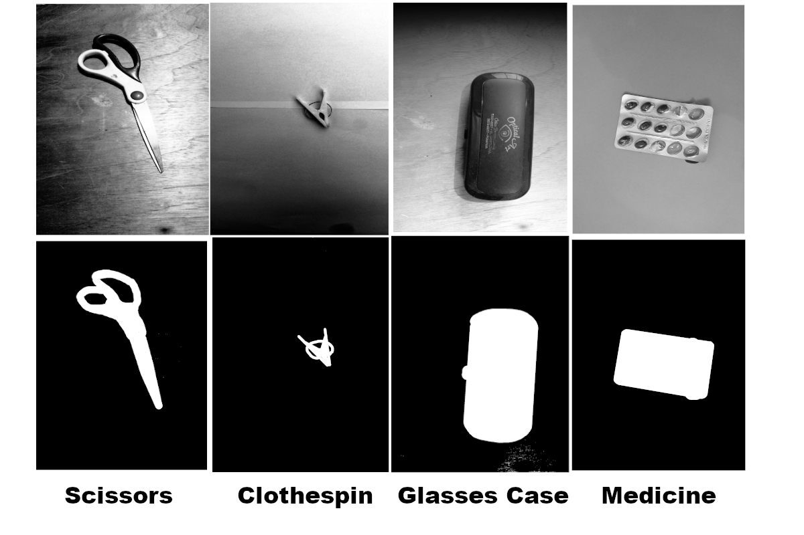
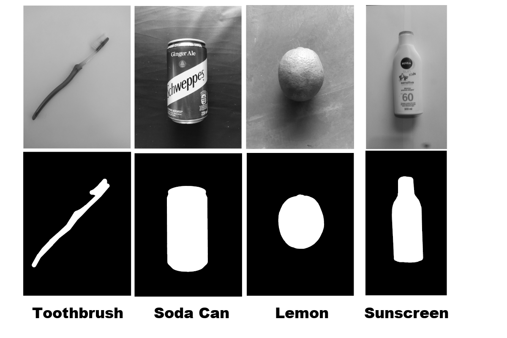
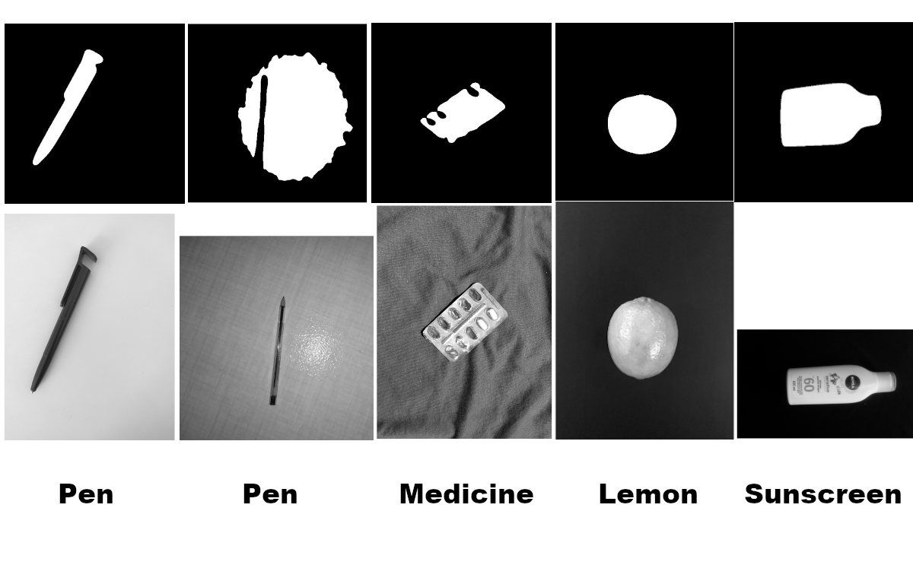
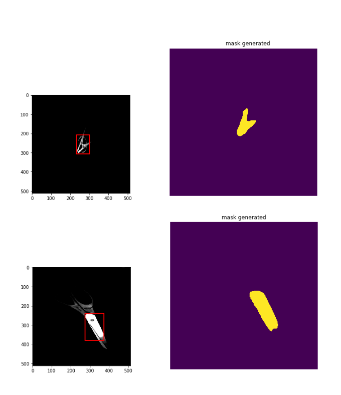

# [EP3] MAC0417/5768 - Visão e Processamento de Imagens (2021)

### Authors:
 - Suayder Milhomem
 - David Oliveira
 - Daniel Hotta

## Simple description

This notebook uses the the classes that we have created in order to describe and read our dataset of objects.

- The libs can be found in this [repository](https://github.com/suayder/computer_vision_eps_usp.git) in a branch named EP3

- The full dataset of images can be found [here](https://drive.google.com/drive/folders/1GJD9P-zUVVOHRNSenVLbm_XS1joCXYm-?usp=sharing).

- The manual ground-truth can be found [here](https://drive.google.com/drive/folders/1lKkDUXQHloZy4YMkQMyr7Qx7NTsfO5wq?usp=sharing)

- [This](https://github.com/suayder/computer_vision_eps_usp/blob/EP3/automatics_pipelines.ipynb) notebook you can see the code to run the pipelines

Based on the goals of the EP3 we listed each result in separated sections as follows:

# 3.1 Image segmentation:

The dataset was segmented using the following code:

- [metrics.py](https://github.com/suayder/computer_vision_eps_usp/blob/EP3/src/metrics.py)

- [segmentation.py](https://github.com/suayder/computer_vision_eps_usp/blob/EP3/src/segment.py)

A brief explanation of the code flow we adopted:

1. Read a image database.

2. Pre-process all images resizing to the desired size and doing the necessary transformations.

3. Do a dilation in the image (So we have a darker image because the holes of the image will appear more, so when the matrix of the original gray and dilated are subtracted the result in this area is highlighted, this highlight appears mainly in regions that have borders.). The output is a binary image with many objects.

4. As we know that the object is larger in the image, we filter the larger object to choose as our object and use its segmentation.

## Manual Segmentation Samples

## Automatic Segmentation Samples

## Proccess of Segmentation

## Performance

The code and results are located [here](https://colab.research.google.com/drive/1TYL6c8lbtLtx-kqkVndn9YyGEK7lwaM9?usp=sharing) at "Metrics for segmentation" section.

METRICS RESULTS:

	precision: 0.5758390769947669
	reccall of the segmentation: 0.8002268693506877

# 3.2 Classification

The dataset was classified using the following code:

- [metrics.py](https://github.com/suayder/computer_vision_eps_usp/blob/EP3/src/metrics.py)

- [classifier.py](https://github.com/suayder/computer_vision_eps_usp/blob/EP3/src/classifier.py)

To classify the image, basically we followed these steps:

1. Read a image database.

2. Pre-process all images resizing to the desired size and doing the necessary transformations.

3. Train a PCA and SVM model, if necessary.

4. Predict the values with SVM.

5. Calculate accuracy and f1-score.

## Classification Sample

The result of the classification and the code are located at the end of [this](https://colab.research.google.com/drive/1TYL6c8lbtLtx-kqkVndn9YyGEK7lwaM9?usp=sharing) notebook.

## Performance

This model was trained using SVM and PCA for dimensionality reducion

> The dataset was splited into train and test data, in the train data we have used 80% of the dataset and the other 20% in the test set.

> Basicaly we have used the num of feature to pca setted as 15 and trained svm for a classification task, the results are printed bellow:

PCA fitted
SVM fitted

METRICS RESULTS:

	Accuracy: 0.68
	F1-score: 0.63
