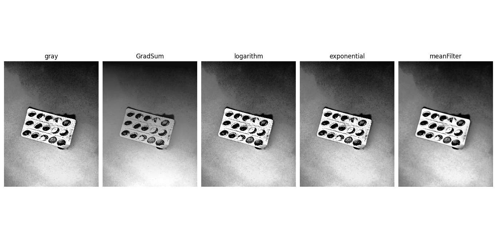

# [EP3] MAC0417/5768 - Visão e Processamento de Imagens (2021)

### Authors:
 - Suayder Milhomem
 - David Oliveira
 - Daniel Hotta

## Simple description

This notebook uses the the classes that we have created in order to describe and read our dataset of objects.

- The libs can be found in this [repository](https://github.com/suayder/computer_vision_eps_usp.git) in a branch named EP3

- The full dataset of images can be found [here](https://drive.google.com/drive/folders/1GJD9P-zUVVOHRNSenVLbm_XS1joCXYm-?usp=sharing).

- The manual ground-truth cab be found [here](https://drive.google.com/drive/folders/1lKkDUXQHloZy4YMkQMyr7Qx7NTsfO5wq?usp=sharing)

Based on the goals of the EP3 we listed each result in separate sections as follows:

# 3.1 Image segmentation:

The dataset was segmented using the following code:

- [metrics.py](https://github.com/suayder/computer_vision_eps_usp/blob/EP3/src/metrics.py)

- [segmentation.py](https://github.com/suayder/computer_vision_eps_usp/blob/EP3/src/segment.py)

A brief explanation of the code flow we adopted:

1. a

2. a

## Manual Segmentation Samples

## Automatic Segmentation Samples

## Performance

# 3.2 Classification

The dataset was classified using the following code:

- [metrics.py](https://github.com/suayder/computer_vision_eps_usp/blob/EP3/src/metrics.py)

- [classifier.py](https://github.com/suayder/computer_vision_eps_usp/blob/EP3/src/classifier.py)

A brief explanation of the code flow we adopted:

1. a

2. a

## Classification Samples

## Performance

